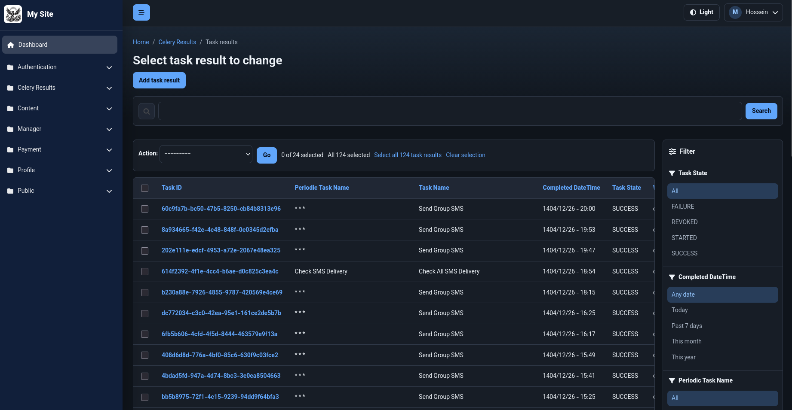

# Django Simorgh

A beautiful, modern, fully redesigned Django admin interface.

Django Simorgh replaces the default Django admin UI with a complete custom design: dark sidebar, collapsible app groups, responsive tables, modern forms, RTL layout, 9 color themes, light/dark mode, and all assets bundled — no CDN required.



---

## Installation

```bash
pip install django-simorgh
```

---

## Django Configuration

### 1. Add to INSTALLED_APPS

`django_simorgh` must appear **before your project apps and before** `django.contrib.admin` so its custom model `Meta` options are registered before models are imported:

```python
INSTALLED_APPS = [
    "django_simorgh",          # ← MUST be before django.contrib.admin
    "django.contrib.admin",
    "django.contrib.auth",
    "django.contrib.contenttypes",
    "django.contrib.sessions",
    "django.contrib.messages",
    "django.contrib.staticfiles",
    # ... your apps
]
```

### 2. Add context processor

```python
TEMPLATES = [
    {
        "BACKEND": "django.template.backends.django.DjangoTemplates",
        "DIRS": [],
        "APP_DIRS": True,
        "OPTIONS": {
            "context_processors": [
                "django.template.context_processors.debug",
                "django.template.context_processors.request",   # required
                "django.contrib.auth.context_processors.auth",
                "django.contrib.messages.context_processors.messages",
                "django_simorgh.context_processors.simorgh_context",  # ← add this
            ],
        },
    },
]
```

### 3. Collect static files

```bash
python manage.py collectstatic
```
---

## Theme Color Configuration

```python
# settings.py
DJANGO_ADMIN_THEME_COLOR = "green"   # default
```

Available values: `green`, `blue`, `red`, `yellow`, `black`, `purple`, `orange`, `pink`, `navy`

---

## Branding, Logo, and Favicon Configuration

```python
DJANGO_ADMIN_SITE_HEADER = "My Admin Panel"   # default: "Simorgh Admin"
DJANGO_ADMIN_LOGO        = "path/to/logo.png"
DJANGO_ADMIN_FAVICON     = "path/to/favicon.ico"
```

If logo or favicon are not set, the bundled default assets are used automatically.

---

## Model Icon Configuration

### Option 1 — Model Meta (recommended)

```python
from django.db import models

class Product(models.Model):
    name = models.CharField(max_length=120)

    class Meta:
        simorgh_icon = "fa-solid fa-box"
        simorgh_app_icon = "fa-solid fa-store"
```

`simorgh_icon` controls the model icon. `simorgh_app_icon` can be defined on any model in the app and controls the sidebar app-group icon.

Because these are custom Django `Meta` options, keep `django_simorgh` before your own apps in `INSTALLED_APPS`.

### Option 2 — Per-ModelAdmin

```python
from django.contrib import admin
from .models import Product

@admin.register(Product)
class ProductAdmin(admin.ModelAdmin):
    icon = "fa-solid fa-box"   # any Font Awesome 6 Free class string
```

### Option 3 — Via settings

```python
DJANGO_ADMIN_ICONS = {
    "shop": {
        "_app_icon": "fa-solid fa-store",   # icon for the app group in the sidebar
        "Product":   "fa-solid fa-box",
        "Category":  "fa-solid fa-tag",
        "Order":     "fa-solid fa-receipt",
    },
    "auth": {
        "_app_icon": "fa-solid fa-shield-halved",
        "User":      "fa-solid fa-user",
        "Group":     "fa-solid fa-users",
    },
}
```

Keys: `app_label` (outer), `ModelName` / `_app_icon` (inner).

Resolution order:
1. Model `Meta.simorgh_icon`
2. `ModelAdmin.icon` attribute
3. `DJANGO_ADMIN_ICONS` settings dict
4. Built-in defaults for `auth`, `admin`, `contenttypes`, etc.
5. Generic fallback `fa-solid fa-circle-dot`

---


## RTL Support

Set `LANGUAGE_CODE` to a RTL language and Django's `LANGUAGE_BIDI` will be `True` automatically. The template uses this to set `dir="rtl"` on the `<html>` element, which flips the sidebar, navbar, and tables.

Font selection is handled entirely by CSS `unicode-range` — no settings needed:
- Latin/English characters → **Sniglet**
- Arabic/Persian characters → **Vazirmatn**

```python
LANGUAGE_CODE = "fa-ir"   # RTL layout + correct fonts — no extra config needed
```

---

## License

MIT — see [LICENSE](LICENSE) for details.
